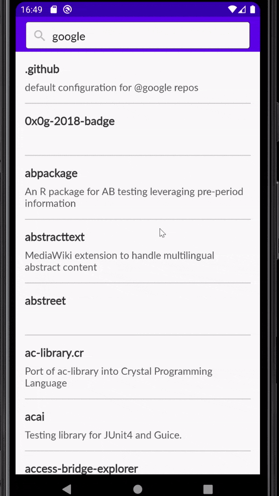
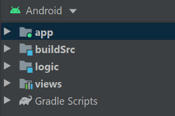
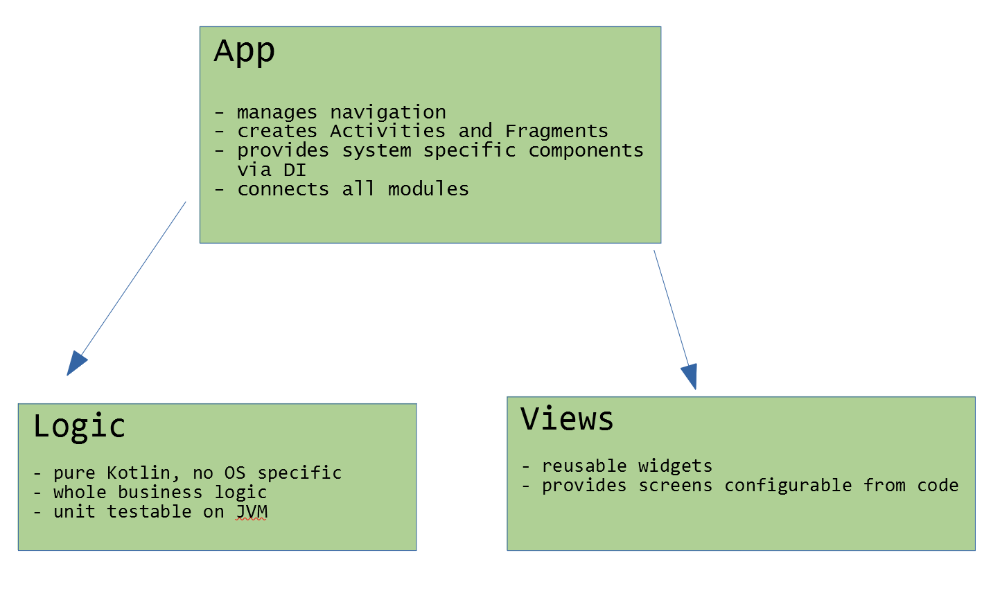

# Android App schema proposal
This app is created to show the idea of the architecture scheme that is:\
- modular
- easy to test automatically

The app shows list of Github repositories for a given user.\
After choosing a repository, app shows it's details.\
\
 

## Modular

\
