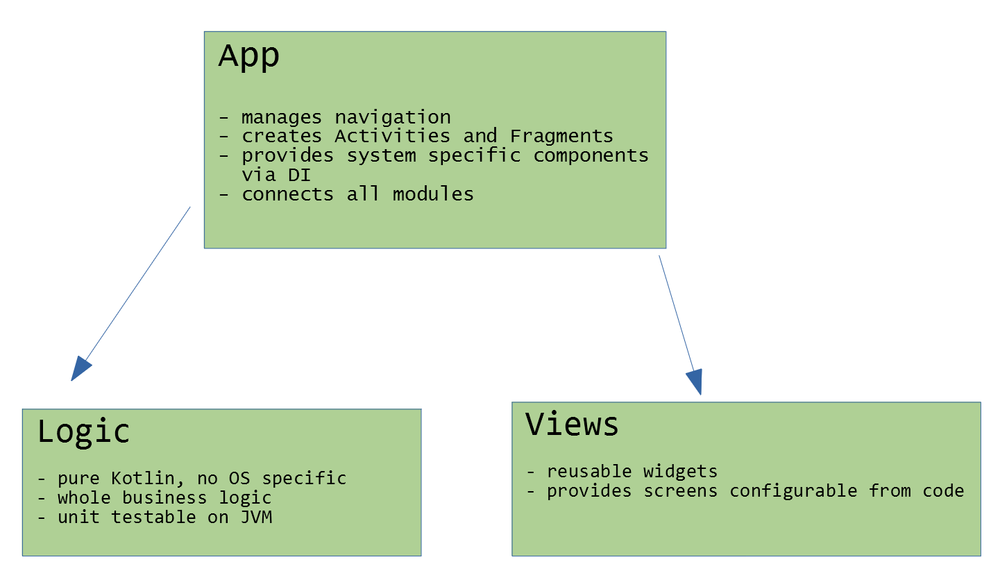

# Android App schema proposal
This app is created to show the idea of the architecture scheme that is:
- modular
- easy to test automatically
- easy to expand
- cool

The app shows list of Github repositories for a given user.\
After choosing a repository, app shows it's details.\
\
\


## Modular
\


## Logic
```kotlin
interface ListLogic : Logic {
    fun reload()
    fun loadNextPage()
    fun itemClick(detailsLogic: DetailsLogic, repositoryName: String?)
    var userName: String
    var wideScreen: Boolean

    val list: Observable<List<Repository>>
    val loading: Observable<Boolean>
    val error: Observable<Optional<ErrorType>>
    val closeApp: Observable<Unit>
    val showViews: Observable<ShowViews>
    val hasNextPage: Observable<Boolean>

    enum class ErrorType { USER_DOESNT_EXIST, NO_CONNECTION, OTHER }
    enum class ShowViews { LIST, DETAILS, BOTH }
}
```

Communication from the app to the logic module:
- via method calls and setting its variables.

Communication from the logic module to the app:
- via exposed Observables

## Logic unit tests
[ListLogic tests](blob/master/logic/src/test/kotlin/me/szymanski/arch/logic/test/ListTest.kt)
It uses [kotest](https://github.com/kotest/kotest) framework that allows to write unit tests efficiently.\
Setting `isolationMode = IsolationMode.InstancePerLeaf` allows to write tests `On download 2nd page` and
`On error downloading 2nd page` without taking care of preparing previous steps like `On started and download 1st page`.
Whole path is executed for every leaf.
Suggested method of running tests (because of nice UI output) is to run from Android Studio Gradle menu `logic/Tasks/verification/test`.


